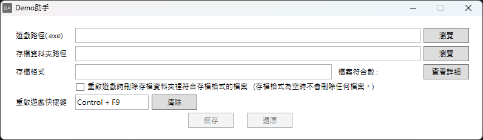
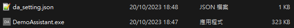

# Demo助手



這是一個可以按下快捷鍵後，就可以刪除存檔並重新開啟遊戲的小工具。


# 流程
1. [下載](https://github.com/CornerHF/demo_assistant/releases)並打開「DemoAssistant.exe」。

2. 設定遊戲路徑（可以使用絕對、相對路徑，或是「%appdata%」這類型的Windows環境變數）。

3. 設定存檔資料夾路徑（可以使用絕對、相對路徑，或是「%appdata%」這類型的Windows環境變數）。

4. 設定存檔格式，有多種檔案時請使用「|」作為分隔，設定後可以按「查看詳細」去查看目前已標記的檔案。

    例子1：標記所有.sav的檔案
    ```
    存檔格式：*.sav
    ```
    例子2：標記所有.sav和.config的檔案
    ```
    存檔格式：*.sav|*.config
    ```
    例子3：標記game.log和所有.sav和.config的檔案
    ```
    存檔格式：game.log|*.sav|*.config
    ```

5. 若需要重啟遊戲時刪除已標記的存檔，請把「重啟遊戲時刪除存檔………不會刪除任何檔案。」的選項打勾。

6. 點選「重啟遊戲快捷鍵」右邊的文字方塊，接著設定重新開啟遊戲的快捷鍵。

7. 按下「保存」。**（注意，若有未保存的設定時不能重啟遊戲。）**

8. 你現在可以使用了，按下快捷鍵便會有提示視窗彈出。


# 設定檔
以上的設定會儲存在「DemoAssistant.exe」同一層的「da_setting.json」裡。



